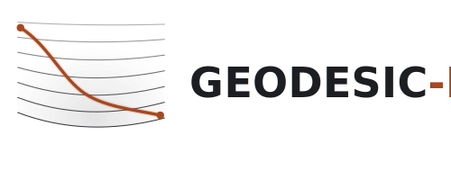

# GEODESIC-M

<p align="center">
  
</p>

[](LICENSE)
[](https://github.com/fcarvajalbrown/GEODESIC-M/releases)
[](https://www.rust-lang.org/)
[](https://www.rust-lang.org/)
[](ROADMAP.md)

Deterministic Protein Manifold Simulator — a physics-based molecular dynamics engine, written in Rust, for mapping protein conformational energy landscapes.

Unlike probabilistic structure predictors, GEODESIC-M produces a deterministic, auditable trajectory: given the same initial state and timestep, every run is bit-for-bit identical.

---

## Technical Approach

Protein conformational transitions are treated as **geodesics on a Riemannian manifold** rather than Newtonian paths through flat space. The manifold geometry is defined by the Jacobi metric:

$$g^J_{ij}(x) = 2(E - V(x))\, m_i\, \delta_{ij}$$

where $E$ is the conserved total energy and $V(x)$ is the potential energy surface. Barriers become narrow metric necks; the folding funnel is a region of positive Ricci curvature. This is the Jacobi–Maupertuis principle — a 200-year-old result, recently validated computationally for protein dynamics (Diepeveen et al., *PNAS* 2024).

**Integrator:** Geodesic BAOAB (Leimkuhler & Matthews, *Proc. R. Soc. A* 2016) — true geodesic drift on the holonomic constraint manifold via the exponential map, not SHAKE/RATTLE reprojection. Supports timesteps of 4–9 fs with preserved energy conservation.

**Analysis:** Persistent Sheaf Laplacian (Hayes et al., *J. Phys. Chem. B* 2025) for multi-scale flexibility analysis; Zigzag persistence for coordinate-free topological characterization of folding/unfolding events.

Full architecture: [`docs/SAD.md`](docs/SAD.md)

---

## Status

| Milestone | Description | Status |
|---|---|---|
| M1 | CPU-only headless simulation (Rayon + SIMD) | In progress — v0.3 of 4 |
| M2 | GPU backend (wgpu compute shaders) | Planned |
| M3 | Hybrid CPU+GPU | Planned |
| M4 | 3D viewer + live trajectory streaming | Planned |
| M5 | Data export UI | Planned |

There is no working simulation yet — see [`ROADMAP.md`](ROADMAP.md) for the
version-by-version breakdown and current state, and
[`memory.md`](memory.md) for a detailed session handoff (what's built,
what's broken, what's next). As of this writing: file I/O (AMBER
prmtop/inpcrd parsing, DCD/CSV/JSON/PDB writing) works and is tested. The
force field is partially done and gradient-tested (non-bonded LJ, bonds,
angles); dihedral forces are implemented but known incorrect for general
geometry (see `memory.md`). The constraint solver, integrator, and CLI
don't exist yet.

---

## Building

Requires Rust stable (1.78+).

```sh
cargo build --release
```

Default build is M1 CPU-only. No external dependencies beyond the Rust toolchain.

Optional features:

```sh
cargo build --release --features gpu     # GPU backend (wgpu)
cargo build --release --features topo    # PSL + Zigzag pipeline
cargo build --release --features gui     # 3D viewer
```

---

## Usage (M1) — target interface, not yet implemented

The CLI binary is currently a stub (`fn main() {}`) — this is the
interface v0.4 will ship, not something you can run today:

```sh
# Compute total energy — required before a run (defines the Jacobi metric)
geodesic energy protein.prmtop protein.inpcrd

# Run simulation
geodesic run config.toml
```

Inputs: AMBER `.prmtop` + `.inpcrd` + `config.toml`
Outputs: `output.dcd` (trajectory), `energy.csv` (per-step energies)

See [`docs/SAD.md §10`](docs/SAD.md) for the full I/O format specification.

---

## License

GPL-2.0-or-later. See [LICENSE](LICENSE).

Some test fixtures under `geodesic-engine/tests/fixtures/` and
`geodesic-io/tests/fixtures/` (`ala_dipeptide.prmtop`/`.inpcrd`) are sourced
from [choderalab/YankTools](https://github.com/choderalab/YankTools)
(GPL-2.0), generated via AMBER `tleap` (`leaprc.ff96`,
`sequence { ACE ALA NME }`). See the test files that load them for exact
provenance.

---

## Author

Felipe Carvajal Brown — Felipe Carvajal Brown Software
Magíster en Simulaciones Numéricas, Universidad Politécnica de Madrid
ORCID: [0000-0002-8300-7587](https://orcid.org/0000-0002-8300-7587)
